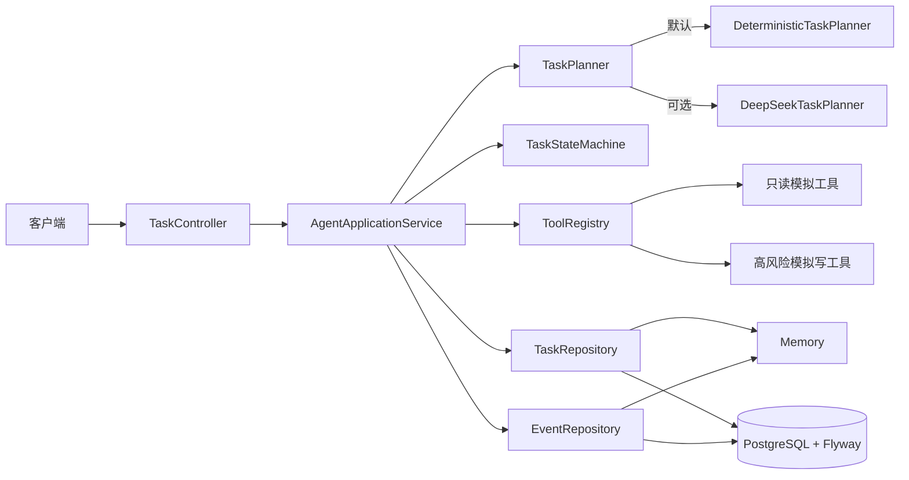
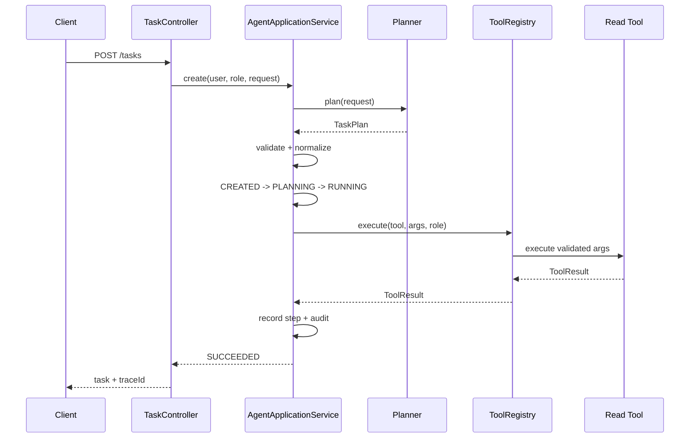
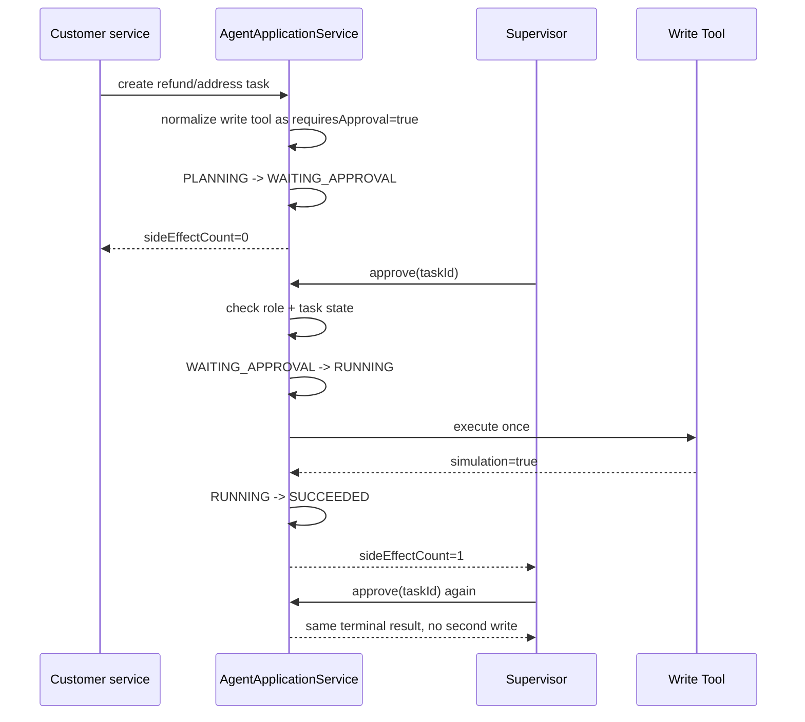
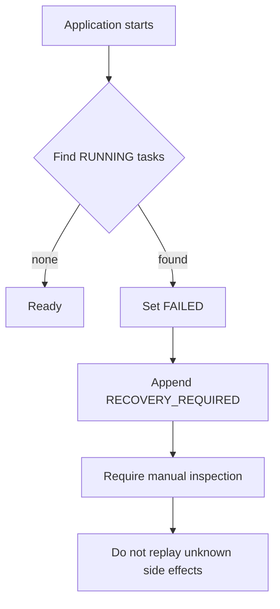
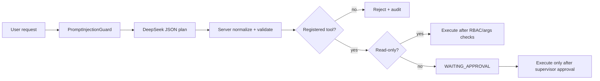
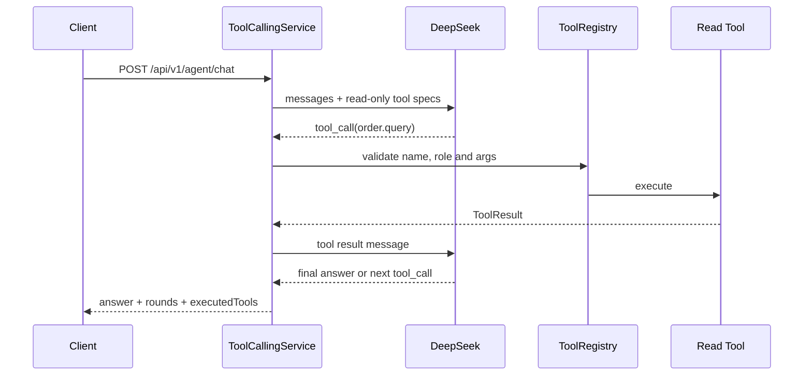
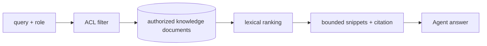

# 关键流程图

这些图只描述当前代码已经实现的流程，适合在 README、面试或演示时使用。

## 组件关系

```mermaid
flowchart LR
    C[客户端] --> TC[TaskController]
    TC --> AS[AgentApplicationService]
    AS --> P[TaskPlanner]
    P -->|默认| DP[DeterministicTaskPlanner]
    P -->|可选| DS[DeepSeekTaskPlanner]
    AS --> SM[TaskStateMachine]
    AS --> TR[ToolRegistry]
    TR --> RT[只读模拟工具]
    TR --> WT[高风险模拟写工具]
    AS --> RP[TaskRepository]
    AS --> EP[EventRepository]
    RP --> MEM[Memory]
    RP --> PG[(PostgreSQL + Flyway)]
    EP --> MEM
    EP --> PG
```

## 只读任务

```mermaid
sequenceDiagram
    participant U as Client
    participant API as TaskController
    participant S as AgentApplicationService
    participant P as Planner
    participant R as ToolRegistry
    participant T as Read Tool

    U->>API: POST /tasks
    API->>S: create(user, role, request)
    S->>P: plan(request)
    P-->>S: TaskPlan
    S->>S: validate + normalize
    S->>S: CREATED -> PLANNING -> RUNNING
    S->>R: execute(tool, args, role)
    R->>T: execute validated args
    T-->>R: ToolResult
    R-->>S: ToolResult
    S->>S: record step + audit
    S-->>API: SUCCEEDED
    API-->>U: task + traceId
```

## 高风险审批

```mermaid
sequenceDiagram
    participant U as Customer service
    participant S as AgentApplicationService
    participant M as Supervisor
    participant W as Write Tool

    U->>S: create refund/address task
    S->>S: normalize write tool as requiresApproval=true
    S->>S: PLANNING -> WAITING_APPROVAL
    S-->>U: sideEffectCount=0
    M->>S: approve(taskId)
    S->>S: check role + task state
    S->>S: WAITING_APPROVAL -> RUNNING
    S->>W: execute once
    W-->>S: simulation=true
    S->>S: RUNNING -> SUCCEEDED
    S-->>M: sideEffectCount=1
    M->>S: approve(taskId) again
    S-->>M: same terminal result, no second write
```

## 重启恢复

```mermaid
flowchart TD
    A[Application starts] --> B{Find RUNNING tasks}
    B -->|none| C[Ready]
    B -->|found| D[Set FAILED]
    D --> E[Append RECOVERY_REQUIRED]
    E --> F[Require manual inspection]
    F --> G[Do not replay unknown side effects]
```

## DeepSeek 的安全边界

```mermaid
flowchart LR
    Q[User request] --> G[PromptInjectionGuard]
    G --> DS[DeepSeek JSON plan]
    DS --> V[Server normalize + validate]
    V --> W{Registered tool?}
    W -->|no| X[Reject + audit]
    W -->|yes| A{Read-only?}
    A -->|yes| E[Execute after RBAC/args checks]
    A -->|no| H[WAITING_APPROVAL]
    H --> E2[Execute only after supervisor approval]
```

## 多轮只读 Tool Calling

```mermaid
sequenceDiagram
    participant U as Client
    participant S as ToolCallingService
    participant M as DeepSeek
    participant R as ToolRegistry
    participant T as Read Tool

    U->>S: POST /api/v1/agent/chat
    S->>M: messages + read-only tool specs
    M-->>S: tool_call(order.query)
    S->>R: validate name, role and args
    R->>T: execute
    T-->>S: ToolResult
    S->>M: tool result message
    M-->>S: final answer or next tool_call
    S-->>U: answer + rounds + executedTools
```

## RAG ACL

```mermaid
flowchart LR
    Q[query + role] --> F[ACL filter]
    F --> K[(authorized knowledge documents)]
    K --> R[lexical ranking]
    R --> S[bounded snippets + citation]
    S --> A[Agent answer]
```
